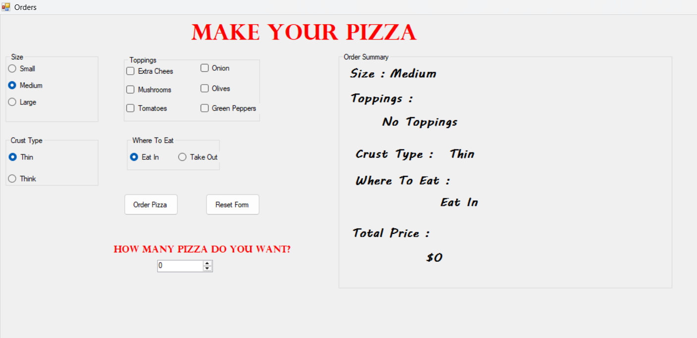

# 🍕 Pizza Ordering System

A desktop application built with **C#** and **Windows Forms** that allows users to customize pizza orders through a simple and interactive graphical interface.

---

## 📖 Overview

This project was developed to strengthen my understanding of desktop application development using **C#**, **Windows Forms**, and **Object-Oriented Programming (OOP)**.

The application enables users to fully customize their pizza order while calculating the total price automatically and displaying a live order summary.

---

# ✨ Features

- 🍕 Choose Pizza Size
- 🧀 Select Multiple Toppings
- 🥖 Choose Crust Type
- 🍽️ Eat In / Take Out
- 💰 Automatic Price Calculation
- 📋 Live Order Summary
- 🔄 Reset Order
- ✅ Order Confirmation

---

# 🛠️ Technologies Used

- C#
- .NET Framework
- Windows Forms
- Visual Studio

---

# 📚 Concepts Practiced

- Object-Oriented Programming (OOP)
- Event-Driven Programming
- Windows Forms Development
- Conditional Logic
- UI Design
- Code Organization

---

# 📸 Screenshots

## Welcome Screen


## Order Screen



---

# 🚀 How to Run

1. Clone the repository

```bash
git clone https://github.com/kerolos5mamdouh/Pizza-Ordering-System.git
```

2. Open the solution in **Visual Studio**

3. Build and Run the project.

---

# 👨‍💻 Author

**Kerolos Mamdouh**

- GitHub: https://github.com/kerolos5mamdouh
- LinkedIn: https://www.linkedin.com/in/kerolos-mamdouh-98601237b/

---

⭐ If you like this project, don't forget to give it a **Star**.
